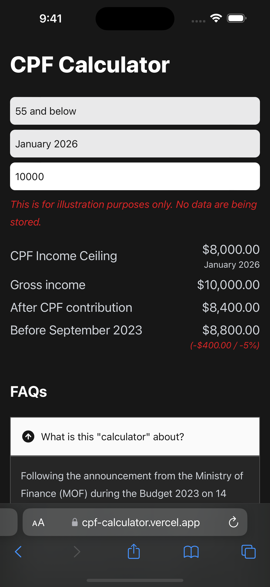

# CPF Contribution Calculator

<!-- ALL-CONTRIBUTORS-BADGE:START - Do not remove or modify this section -->

[](#contributors-)

<!-- ALL-CONTRIBUTORS-BADGE:END -->

Site: https://cpf-contribution-calculator.vercel.app

## Summary

Following the recent announcement from the Ministry of Finance during the Budget 2023 on 13 February 2023, the income ceiling will be raised from $6000 to $8000 by September 2026.

This is a simple calculator to estimate the new "take-home" income after CPF contributions. The CPF contributions for individual remains no change following the announcements during the Budget.

## Installation

```shell
# Install packages
pnpm install

# Start the development server
pnpm dev

# Build the project
pnpm build

# Run the unit testing
pnpm test
```

## Screenshot

<p align="center">
    
</p>

## Contributors ✨

Thanks goes to these wonderful people ([emoji key](https://allcontributors.org/docs/en/emoji-key)):

<!-- ALL-CONTRIBUTORS-LIST:START - Do not remove or modify this section -->
<!-- prettier-ignore-start -->
<!-- markdownlint-disable -->
<!-- markdownlint-restore -->
<!-- prettier-ignore-end -->

<!-- ALL-CONTRIBUTORS-LIST:END -->

This project follows the [all-contributors](https://github.com/all-contributors/all-contributors) specification. Contributions of any kind welcome!
